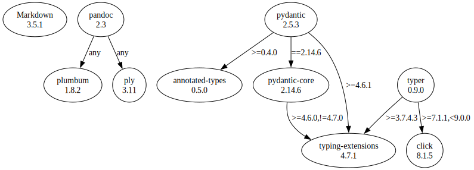

# Third Party Dependencies

<!--[[[fill sbom_sha256()]]]-->
The [SBOM in CycloneDX v1.4 JSON format](https://git.sr.ht/~sthagen/gengive/blob/default/sbom/cdx.json) with SHA256 checksum ([b4cccf8d ...](https://git.sr.ht/~sthagen/gengive/blob/default/sbom/cdx.json.sha256 "sha256:b4cccf8d022e46de001c0cace42b7b65df8a9a16355f6f04dd617f154dda6ffc")).
<!--[[[end]]] (checksum: 4c5390aaa61d615340e66f4c1ab5893f)-->
## Licenses 

JSON files with complete license info of: [direct dependencies](direct-dependency-licenses.json) | [all dependencies](all-dependency-licenses.json)

### Direct Dependencies

<!--[[[fill direct_dependencies_table()]]]-->
| Name                                                               | Version                                           | License     | Author                                                                                                                                                                                                                                                        | Description (from packaging data)                                  |
|:-------------------------------------------------------------------|:--------------------------------------------------|:------------|:--------------------------------------------------------------------------------------------------------------------------------------------------------------------------------------------------------------------------------------------------------------|:-------------------------------------------------------------------|
| [Markdown](https://Python-Markdown.github.io/)                     | [3.3.7](https://pypi.org/project/Markdown/3.3.7/) | BSD License | Manfred Stienstra, Yuri takhteyev and Waylan limberg                                                                                                                                                                                                          | Python implementation of Markdown.                                 |
| [pandoc](https://github.com/boisgera/pandoc/blob/master/README.md) | [2.3](https://pypi.org/project/pandoc/2.3/)       | MIT License | Sébastien Boisgérault                                                                                                                                                                                                                                         | Pandoc Documents for Python                                        |
| [pydantic](https://github.com/pydantic/pydantic)                   | [2.2.1](https://pypi.org/project/pydantic/2.2.1/) | MIT License | Samuel Colvin <s@muelcolvin.com>, Eric Jolibois <em.jolibois@gmail.com>, Hasan Ramezani <hasan.r67@gmail.com>, Adrian Garcia Badaracco <1755071+adriangb@users.noreply.github.com>, Terrence Dorsey <terry@pydantic.dev>, David Montague <david@pydantic.dev> | Data validation using Python type hints                            |
| [typer](https://github.com/tiangolo/typer)                         | [0.9.0](https://pypi.org/project/typer/0.9.0/)    | MIT License | Sebastián Ramírez                                                                                                                                                                                                                                             | Typer, build great CLIs. Easy to code. Based on Python type hints. |
<!--[[[end]]] (checksum: 310f76815d4ae5004825c2e647f9e0ae)-->

### Indirect Dependencies

<!--[[[fill indirect_dependencies_table()]]]-->
| Name                                                             | Version                                                    | License                            | Author                                                                                | Description (from packaging data)                      |
|:-----------------------------------------------------------------|:-----------------------------------------------------------|:-----------------------------------|:--------------------------------------------------------------------------------------|:-------------------------------------------------------|
| [click](https://palletsprojects.com/p/click/)                    | [8.1.5](https://pypi.org/project/click/8.1.5/)             | BSD License                        | UNKNOWN                                                                               | Composable command line interface toolkit              |
| [plumbum](https://github.com/tomerfiliba/plumbum)                | [1.8.2](https://pypi.org/project/plumbum/1.8.2/)           | MIT License                        | Tomer Filiba <tomerfiliba@gmail.com>                                                  | Plumbum: shell combinators library                     |
| [ply](http://www.dabeaz.com/ply/)                                | [3.11](https://pypi.org/project/ply/3.11/)                 | BSD                                | David Beazley                                                                         | Python Lex & Yacc                                      |
| [typing_extensions](https://github.com/python/typing_extensions) | [4.7.1](https://pypi.org/project/typing_extensions/4.7.1/) | Python Software Foundation License | "Guido van Rossum, Jukka Lehtosalo, Łukasz Langa, Michael Lee" <levkivskyi@gmail.com> | Backported and Experimental Type Hints for Python 3.7+ |
<!--[[[end]]] (checksum: b43c2a174339e68896d5aee47e1967fd)-->

## Dependency Tree(s)

JSON file with the complete package dependency tree info of: [the full dependency tree](package-dependency-tree.json)

### Rendered SVG

Base graphviz file in dot format: [Trees of the direct dependencies](package-dependency-tree.dot.txt)



### Console Representation

<!--[[[fill dependency_tree_console_text()]]]-->
````console
Markdown==3.3.7
pandoc==2.3
├── plumbum [required: Any, installed: 1.8.2]
└── ply [required: Any, installed: 3.11]
pydantic==2.2.1
├── annotated-types [required: >=0.4.0, installed: 0.5.0]
├── pydantic-core [required: ==2.6.1, installed: 2.6.1]
│   └── typing-extensions [required: >=4.6.0,!=4.7.0, installed: 4.7.1]
└── typing-extensions [required: >=4.6.1, installed: 4.7.1]
typer==0.9.0
├── click [required: >=7.1.1,<9.0.0, installed: 8.1.5]
└── typing-extensions [required: >=3.7.4.3, installed: 4.7.1]
````
<!--[[[end]]] (checksum: c537ffc001e782ea9cb363a45de25d24)-->
